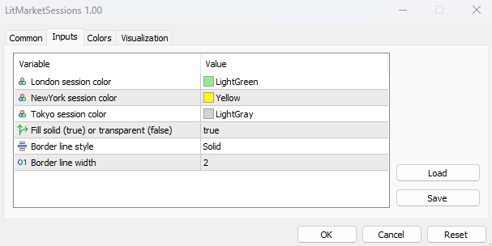
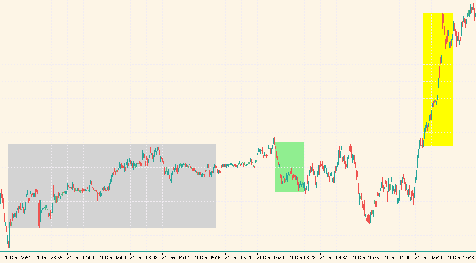

# Forex LIT Market Sessions Indicator
Indicator shows Liquidity Inducement Theorem market sessions.

## Installation
- Open data dir in MetaTrader from menu "File -> Open Data Folder".
- Copy [LitMarketSessions.mq5](MQL5/Indicators/LitMarketSessions.mq5) file to `<METATRADER_DATA_DIR>\MQL5\Indicators` folder.
- Update list of indicators on Navigator panel.
- Drag `LitMarketSessions` indicator on a graph.

## Configuration
Available settings of indicator:

## Usage
Make a decision to BUY/SELL using indicator:

## History
This indicator is based on [LIT - Timing](docs/LIT_Timing.txt) 
originally developed by Reimfx for [TradingView](https://www.tradingview.com/script/vukoCtAk/).

## Contribution
Feel free to create issue or pull request if any ideas.
